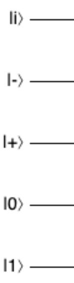

# Quantum Fourier transform

  

This project is based on the construction of an algorithm to execute the Fourier Quantum transform of n qubits starting from a defined initial state. Any comments or ways to improve the code is completely welcome.

  

## Getting Started

  

To execute this project, you can clone the repository and execute the following command-line commands:

```

clang++ -std=c++11 main.cpp -o main

./main

```

>  **Note:** This project uses C ++ 11 and it was successfully tested on a macOS Mojave (for other OS g++ can be used )

  

## Description

In the main.cpp file, the object of the QRegister class is instantiated, which contains the initial states of each of the qubits that are part of the quantum register.

For example:
> QRegister qreg ({{0,1}, {1,0}, {1 / sqrt (2), 1 / sqrt (2)}, {1 / sqrt (2), -1 / sqrt (2)}, { 1 / sqrt (2), {0,1 / sqrt (2)}}});

Corresponds to a circuit with the following initial states:



The function getStateVector() returns the resulting state vector that is obtained from the tensor product between the initial states of the circuit or application of the quantum gates, for this specific case, after applying the gate QFT.

This resulting vector is similar to the matrix of final amplitudes obtained in the [Quirk simulator](https://algassert.com/quirk) with which the results of the execution can be compared.

The applyQFT () function is the function applied by the respective matrix associated with the Fourier Quantum Transform on the number of qubits initially defined in the quantum register.
